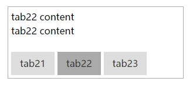

# MovableTab
Movable Tab —— 简单tab，支持自动滑动

###options###
```html
addStyle: true,//是否自动添加样式
event: "click",//切换tab事件：mouseover、click ...
title: "top",//标题显示位置：top/bottom/none
titleWidth: null,//每个tab title的宽度
width: "auto",//tab宽度，不包括边框、补白
height: "auto",//tab高度(含title)，auto：各tab内容自身高；fix：所有tab为最大tab高；{num}：指定tab一致高度
movable: false,//move 滑动 或 display 显隐
type: "linear", //滑动类型 linear easeInQuad easeOutQuad easeInOutQuad easeInCubic easeOutCubic easeInOutCubic
        // easeInQuart easeOutQuart easeInOutQuart easeInQuint easeOutQuint easeInOutQuint easeInSine easeOutSine easeInOutSine
auto: false//是否自动切换，movable为true则滑动切换
```
###method###
+ start/stop/pause/resume/toggle()
+ show(index) 切换到某个tab

###snapshot###


###demo###
See [here](http://tt-cc.cn/front-end/jquery-plugins/movableTab)